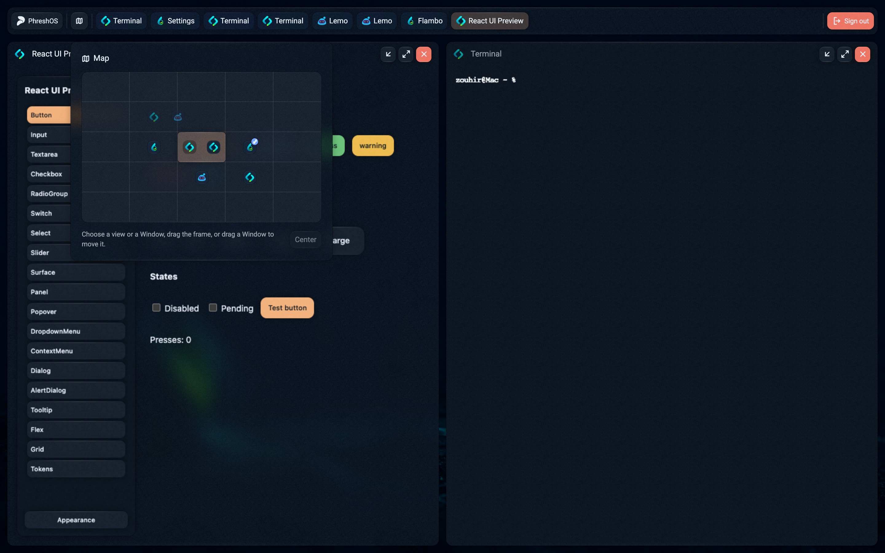
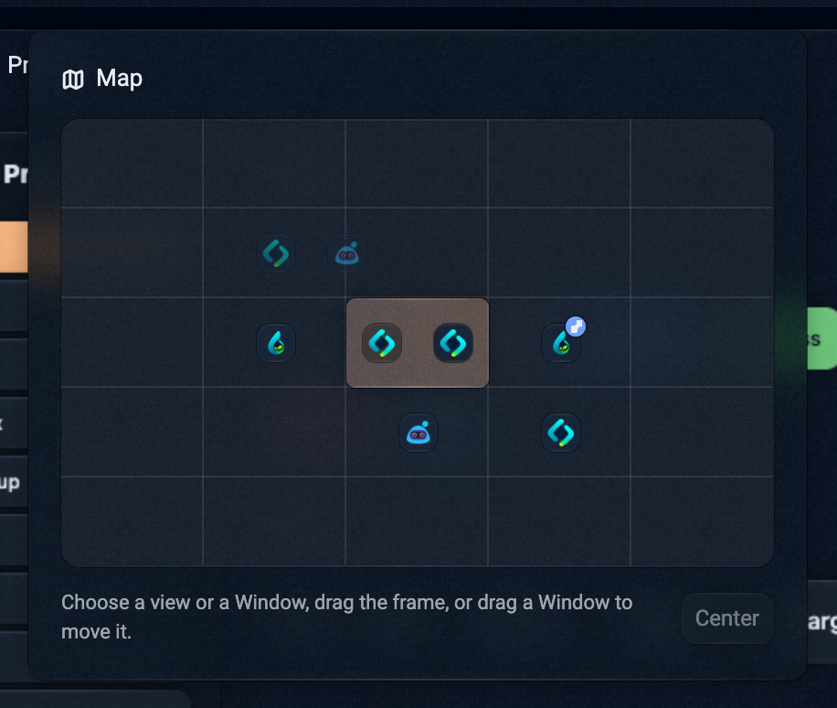
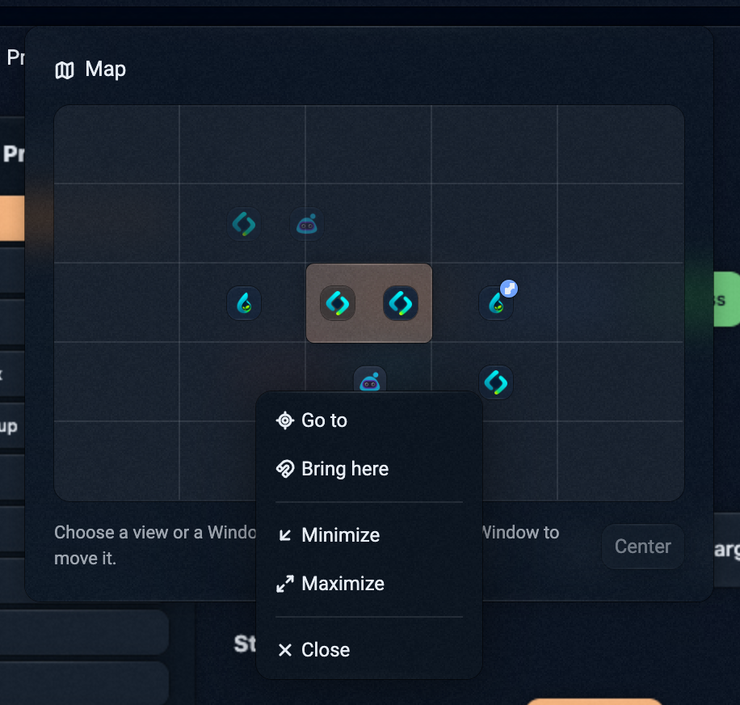
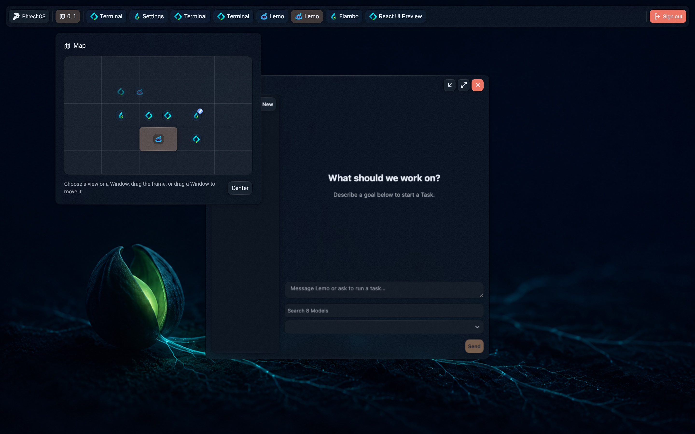

Open enough windows and a desktop turns into a pile. Every new window lands on
top of the last, and finding the one you need means shuffling through the rest.
Virtual desktops help a little, but they are separate boxes: you cannot see what
is in the others, and moving a window between them is a chore.

PhreshOS is an open-source operating system for programs built with web
technology, running on your own machine. On PhreshOS, the desktop is not one
screen. It is a field, and your screen shows one part of it at a time.



## The short answer

Windows live on a plane of five views across and five down, each view the size
of your screen. You look at one view at a time. The **Map** in the Taskbar shows
all of them, with every window where it is, and moves you anywhere with a single
press.

## One field, many views

Zero is the middle of the field, so when you open the desktop you see the
middle view, as you always have. Nothing changes until you want more room.

When you do, there is room around you in every direction. Keep a project in the
middle, your browser one view to the left, a long-running terminal down and to
the right. Each view is a place for one kind of work, and the places are next to
each other, not stacked in separate boxes.

## The Map



The Map is a small picture of the whole field. Each window appears as its icon,
at the spot where it is. The apricot frame is what you are looking at now.

- **Go somewhere:** press a view, or drag the frame anywhere.
- **Go to a window:** press its icon. The view moves to the view the window is
  in, and the window comes to the front.
- **Move a window:** drag its icon to another view. The window goes there.
- **Bring a window here:** right-click it, on the Map or in the Taskbar, and
  choose **Bring here**. It moves into the view you are looking at, keeping its
  place within a view.

The same right-click menu, in both places, also goes to a window, minimizes,
maximizes, or closes it. A maximized window fills its own view, so each view can
have one.



Hover an icon to see which window it is. The front window's icon is apricot,
like its button in the Taskbar; a minimized window's icon is faded, and a
maximized one carries the maximize mark.

## Your agent gets a view too

On PhreshOS, your AI agent uses the same programs you do, through the `phresh`
command line or the SDK. It can open a program and place its window anywhere on
the field, including a view you are not looking at:

```sh
phresh window move --program lemo --process lemo --x "100% - 300" --y -300
```

The agent works in its own view without taking over your screen. When you want
to see what it is doing, open the Map and go there. When you are done watching,
go back. Your work is where you left it.



## Every screen looks where it wants

Where you are looking belongs to your screen alone. Open PhreshOS in two
browsers, or on two monitors, and each one can look at a different part of the
same field: the same windows, the same running programs, two places at once.
The System only keeps where each window is. It knows nothing about views.

## For developers

A program can read where the desktop around it is looking, and follow it as it
moves, so it can open new windows where the person is:

```ts
import { desktop } from "@phreshos/client"

const offset = await desktop.viewport.offset()
desktop.viewport.subscribe("move", offset => {})
```

With the `desktopViewport` permission, a program can also move the view, for
example to take the person to a view it arranged:

```ts
await desktop.viewport.move({ x: 1440, y: 0 })
```

See [Desktop](/docs/system/desktop#where-windows-are) for how positions work on
the field.

## Plant it

PhreshOS is free and open source. Install it, open a few programs, and give
each kind of work its own view.

```sh
npm install --global @phreshos/cli
phresh system install
```
